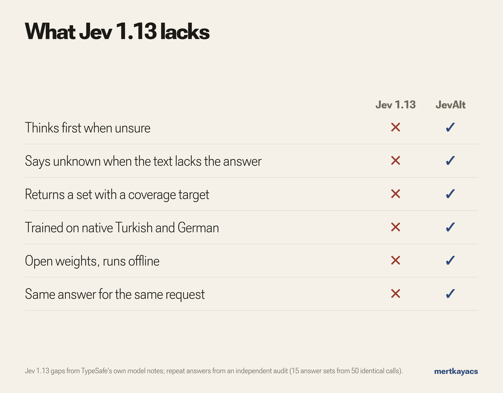

# Measured problems

Small decision models share a set of weak spots. JevOss measures them with probes on 100 typed-decisions items and with held-out rows that each test one weakness, through the same client for every model: the start checkpoint (Intern-Decision-4B), Kev-4B (r10), Laya (0.3.22) and the three JevAlt models, each as shipped.




Kev-4B and Laya lose less accuracy than JevAlt under 600 words of padding (5.4 and 10.4 points, against 12.2 to 17.4). Jev 1.13 is hosted, so its rows come from [TypeSafe's notes](https://docs.typesafe.ai/model-jaggedness/jev-1.13) and an [independent audit](https://github.com/jujumilk3/jev-calibration-audit/blob/main/FINDINGS.md) on a different item set: no option-order flips in 400 items, a 0.125 mean gap between yes/no and two-option answers, and 15 distinct answer sets from 50 identical calls. Every number and every decision: [jevalt-bench results/comparison](https://huggingface.co/datasets/mertkayacs/jevalt-bench/tree/main/results/comparison).

## How to reproduce

Install JevOss and start a model server:

```bash
pip install "jevoss[suites] @ git+https://github.com/mertkayacs/jevoss"
jevalt serve
```

Run each probe against the server (default endpoint `http://127.0.0.1:8000`):

```bash
jevoss probe typed-decisions --probes permutation
jevoss probe typed-decisions --probes injection
jevoss probe typed-decisions --probes distractors
jevoss probe typed-decisions --probes noul
jevoss probe typed-decisions --probes determinism
```

Or run all five at once:

```bash
jevoss probe typed-decisions --limit 100
```

Each probe prints a JSON object with the metrics. The `--limit` flag caps the number of items. The `--probes` flag selects which probes to run; the default is all five.

To point at a different server, pass `--endpoint`:

```bash
jevoss --endpoint https://api.typesafe.ai --api-key "$TYPESAFE_API_KEY" probe typed-decisions
```

## Audit citation

Jev 1.13 values are from [jev-calibration-audit](https://github.com/jujumilk3/jev-calibration-audit/blob/main/FINDINGS.md), an independent audit run on 2026-09-18 against the hosted Jev API. The audit used 400 KoBBQ items with two-option questions, a different setup from the typed-decisions suite used for the measured models. The numbers are included for context, not as a head-to-head comparison.
